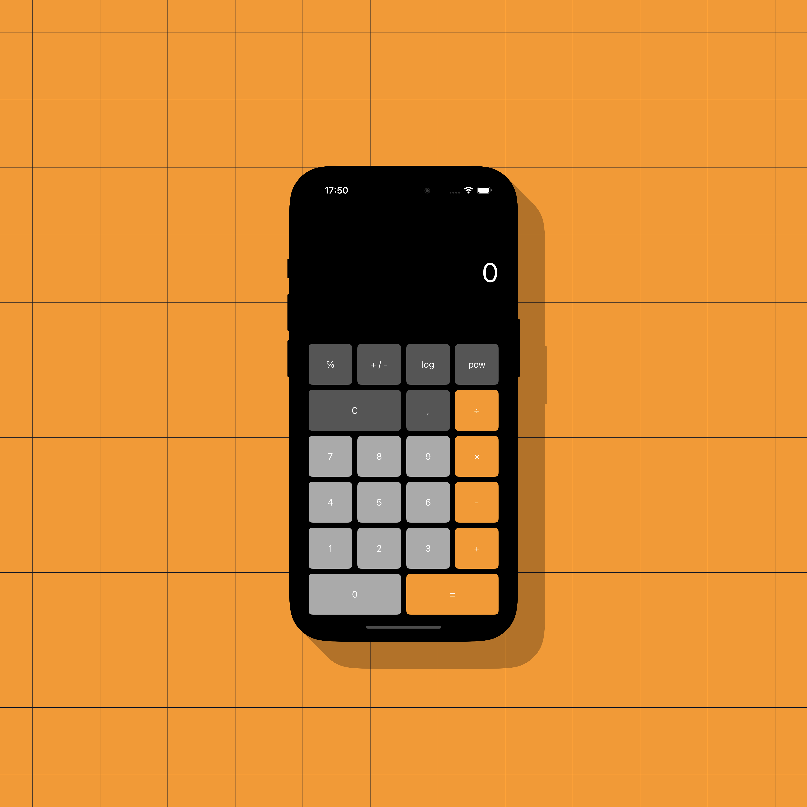
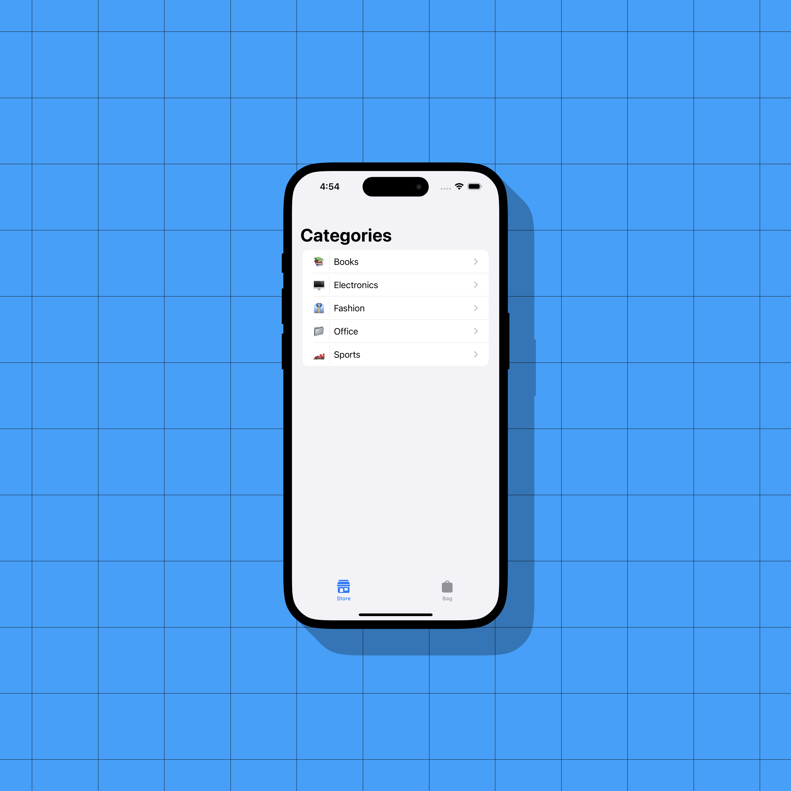
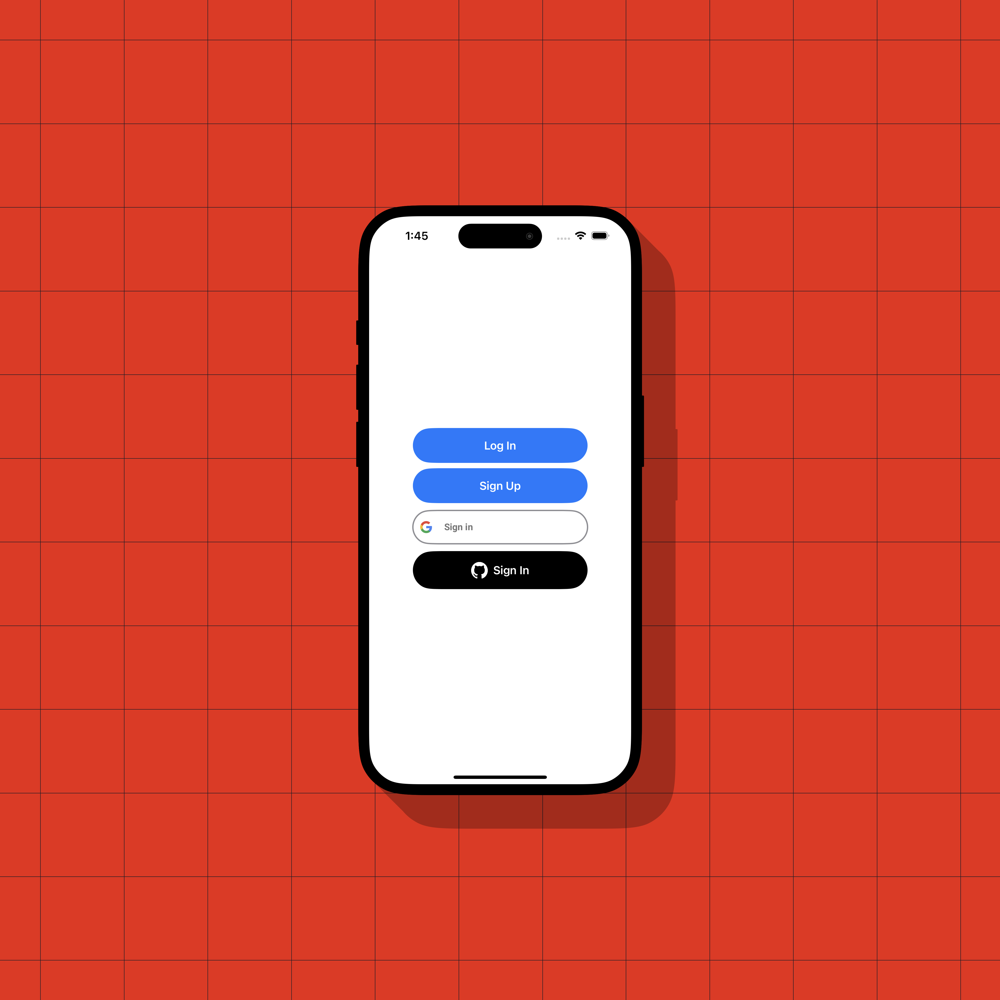
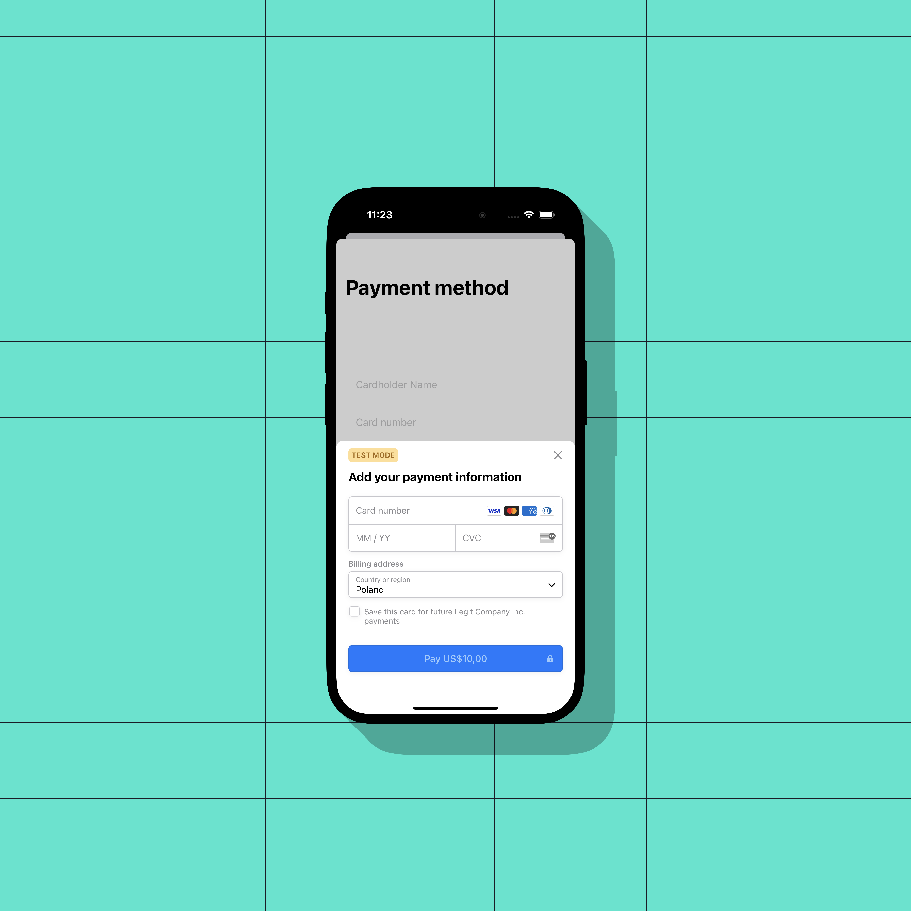

# iOS
Projects built during Mobile devices programming - Apple iOS classes at Jagiellonian University

> Although these projects were created as part of my classes, I have dedicated extra effort to make them well-designed and carefully crafted. While they are relatively simple, they have been developed with care and attention to detail.

## [Calculator](https://github.com/michalzuch/iOS/tree/main/Calculator/Calculator)

✅ 3.0 Simple calculator with addition + option to clear result + result button  
✅ 3.5 Remaining operations: multiplication, division and subtraction  
✅ 4.0 Subsequent actions on the result  
✅ 4.5 Percentage, negative sign, logarithm and power  
✅ 5.0 Scale to a tablet

---

## [To-Do List](https://github.com/michalzuch/iOS/tree/main/To-Do%20List/To-Do%20List)

✅ 3.0 Display a list of predefined tasks (ArrayList)  
✅ 3.5 Display an image in the task view  
✅ 4.0 Delete (swiping) tasks  
✅ 4.5 Change the task status (including structure modification)  
✅ 5.0 Display status on the task list

---

## [Store](https://github.com/michalzuch/iOS/tree/main/Store/Store)

✅ 3.0 Create Product and Category models in Core Data  
✅ 3.5 Load Data on application startup (Fixtures)  
✅ 4.0 Create a product list with a product description subpage in a new view (data from Core Data)  
✅ 4.5 Add option to add product to bag (TabView)  
✅ 5.0 Add option to ad more than one instance of the same product to bag

---

## [Online Store](https://github.com/michalzuch/iOS/tree/main/Online%20Store/Online%20Store)

✅ 3.0 Fetch products and categories from server application  
✅ 3.5 Save data locally to Core Data  
✅ 4.0 Fetch orders from server application (min 5 fields, including one relation)  
✅ 4.5 Display products and categories on two separate lists  
✅ 5.0 Add products from the mobile application

---

## [OAuth](https://github.com/michalzuch/iOS/tree/main/OAuth/OAuth) (Work In Progress)

✅ 3.0 Logging in via the server application  
✅ 3.5 Signing up via the server application  
❌ 4.0 Logging in via Google  
❌ 4.5 Logging in via GitHub / Facebook  
❌ 5.0 Save OAuth2 credentials on the server side

---

## [Payments](https://github.com/michalzuch/iOS/tree/main/Payments/Payments) (Work In Progress)

✅ 3.0 Payment form + mocking by the server application   
❌ 3.5 Local payment model  
❌ 4.0 List of purchased (paid) products + model  
❌ 4.5 Stripe implementation  
❌ 5.0 Add card scanning

---

## [Tests](https://github.com/michalzuch/iOS/tree/main/Tests/Tests) (Work In Progress)

✅ 3.0 Create 30 functional test assertions  
❌ 3.5 Create 20 unit test assertions  
❌ 4.0 Create Product model mocks  
❌ 4.5 Create Category model mocks  
❌ 5.0 Add fixtures
